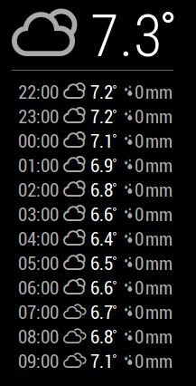

# MMM-Weather-SMHI-Hourly

## Screenshot


## Install
This module uses Yarn.
1. `yarn install`

## Configuration

| Key | Value | Required | Default | Description | 
|-----|-------|---------|---------|---------|
|lon|_numeric_| Y| -| Longitude |
|lat|_numeric_| Y|-| Latitude |
|hours|_numeric_| N| 12| Hours to show. |
|updateInterval | _numeric_ milliseconds |N| 3600000 (60min)| Number of milliseconds between updates |
|debug|_boolean_| N| false| Debug output. |

## Example config

``` json
{
    module: "MMM-Weather-SMHI-Hourly",
    position: 'top_right',
    config: {
        lon: 'xx.xxxxxx',
        lat: 'yy.yyyyyy',
        hours: 12
    }
}
```
## Development
This module isn't perfect. If you find a bug or has a feature request don't hesitate to create an issue OR even better, create a pull request! :D
